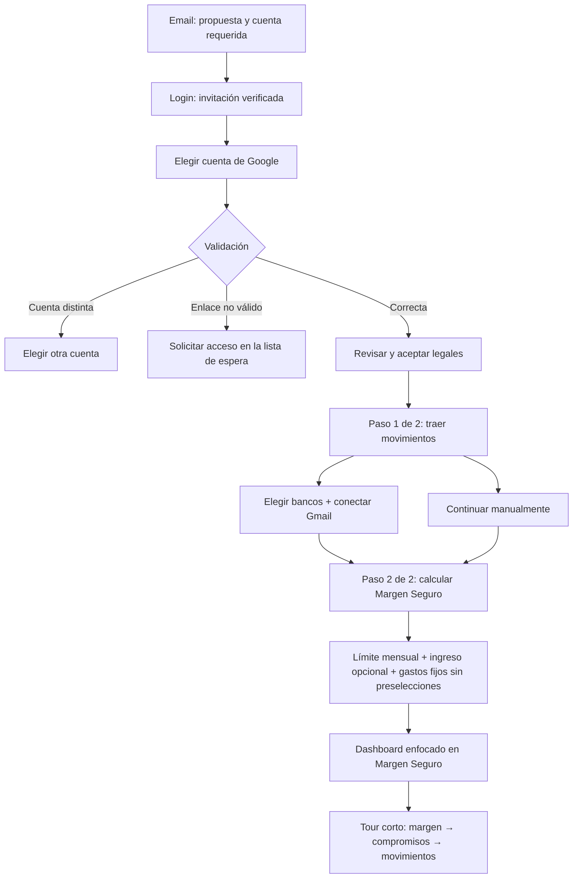

# Auditoría y rediseño del recorrido de una persona invitada

Fecha de revisión: 13 de septiembre de 2026

Alcance: invitación, autenticación, aceptación legal, onboarding, primera entrada al dashboard y recorrido del producto.

## Estado de implementación

El rediseño fue implementado en `codex/first-time-safe-margin`:

- el login diferencia autenticación de la conexión posterior de Gmail y fuerza el selector de cuenta para invitaciones;
- el onboarding comunica dos pasos: traer movimientos y calcular el Margen Seguro;
- el segundo paso exige un límite mensual para la acción principal, guarda un presupuesto global recurrente y comienza sin servicios preseleccionados;
- los errores de guardado mantienen al usuario en el formulario y los reintentos actualizan la nómina y los cobros sin duplicarlos;
- el Margen Seguro aparece primero en el dashboard para todos los usuarios;
- el tour inicial se redujo a Margen Seguro, compromisos y movimientos.

La prueba manual con Google real continúa siendo necesaria para medir tiempo humano, comprensión y confianza percibida.

## Conclusión ejecutiva

El flujo actual es técnicamente coherente y protege bien la invitación: conserva el código durante OAuth, valida la cuenta invitada, inicia los 30 días al activar y diferencia los principales errores. El problema principal no es de acceso, sino de narrativa. Después de activar, la promesa central —saber cuánto se puede gastar con seguridad— pierde protagonismo entre documentos legales, conexión de Gmail, selección de bancos, datos base y un recorrido de seis pasos que no señala el Margen Seguro Diario.

La recomendación es mantener la arquitectura de invitación y simplificar la experiencia alrededor de tres ideas consecutivas:

1. **Esta invitación es para esta cuenta.**
2. **Cuadre obtiene tus movimientos sin tocar tu banca.**
3. **Con esos movimientos y tu punto de partida calcula cuánto puedes gastar hoy.**

Esta auditoría es heurística y está respaldada por pruebas automatizadas del comportamiento observable. Los tiempos y reacciones humanas deben completarse con la prueba controlada incluida al final.

## Recorrido auditado antes del cambio

```mermaid
flowchart TD
    A[Email: beneficios, 30 días y CTA] --> B[/login captura el código]
    B --> C[Banner de fundador]
    C --> D[Continuar con Google]
    D --> E[/auth/callback y bootstrap]
    E --> F{Invitación válida}
    F -->|Cuenta distinta| G[Error: cambiar cuenta]
    F -->|Inválida o vencida| H[Error: volver a lista de espera]
    F -->|Sí| I[Activación e inicio de 30 días]
    I --> J[Aceptar términos y privacidad]
    J --> K[Elegir bancos y conectar Gmail]
    K --> L[Sincronización en segundo plano]
    K --> M[Alternativa manual]
    L --> N[Ingresos y gastos fijos]
    M --> N
    N --> O[Dashboard completo]
    O --> P[Oferta de tour]
    P --> Q[Conexión → período → movimientos → alta manual → analítica → presupuesto]
```

### Inventario de pantallas y decisiones

| Etapa | Mensaje principal actual | Acción exigida | Observación |
|---|---|---|---|
| Email | Invitación de fundador, beneficios, seguridad y 30 días | Pulsar “Activar mi acceso” | La propuesta y la restricción de cuenta están claras. |
| Login | Invitación lista y autenticación con Gmail | Continuar con Google | “Autenticación con Gmail” puede confundirse con el permiso posterior para leer notificaciones. |
| Bootstrap | Validación silenciosa | Esperar | El código desaparece de la URL y permanece en la sesión, lo cual es correcto. |
| Legales | Privacidad antes que todo | Abrir documentos, marcar y aceptar | El login ya dice “Al continuar aceptas”, por lo que la aceptación explícita parece repetida. |
| Conexión | Activar movimientos automáticos | Elegir bancos y conectar Gmail, o seguir manualmente | Reúne privacidad, bancos, OAuth y sincronización en un mismo momento. |
| Punto de partida | Ingresos y cobros fijos | Confirmar valores o saltar | El cálculo en vivo comunica valor, pero tres gastos aparecen seleccionados por defecto. |
| Dashboard | Panorama financiero completo | Decidir qué mirar | La cantidad de módulos compite con el Margen Seguro Diario. |
| Tour | Recorrido de menos de un minuto | Recorrer seis objetivos o saltar | Explica navegación, pero no destaca explícitamente la promesa principal. |

## Evaluación heurística

Escala: 1 = deficiente, 5 = muy sólido. Estas puntuaciones son una línea base de producto, no resultados de una prueba con usuarios.

| Etapa | Claridad | Bajo esfuerzo | Confianza | Continuidad | Aporte al core |
|---|---:|---:|---:|---:|---:|
| Email | 5 | 5 | 5 | 4 | 5 |
| Login | 4 | 5 | 4 | 4 | 3 |
| OAuth de acceso | 3 | 3 | 3 | 3 | 1 |
| Legales | 4 | 2 | 4 | 2 | 1 |
| Bancos y Gmail | 4 | 2 | 4 | 4 | 4 |
| Punto de partida | 3 | 3 | 3 | 4 | 5 |
| Primer dashboard | 2 | 3 | 3 | 3 | 3 |
| Tour inicial | 4 | 2 | 4 | 2 | 2 |

## Qué mantener, mejorar, mover y quitar

| Decisión | Elemento | Prioridad | Motivo y cambio recomendado |
|---|---|---:|---|
| Mantener | Código opaco, URL limpia y persistencia durante OAuth | — | Reduce exposición y permite regresar del proveedor sin perder la invitación. |
| Mantener | Inicio de los 30 días al activar | — | Es justo y coincide con el email. Confirmarlo una sola vez después de activar. |
| Mantener | Explicación de Gmail de solo lectura | — | Resuelve la principal preocupación de confianza. Mantenerla cerca del permiso real. |
| Mantener | Sincronización en segundo plano | — | Evita bloquear el onboarding. Usar el paso de punto de partida mientras termina. |
| Mantener | Cálculo preliminar del dinero libre | — | Es la primera demostración tangible del valor central. |
| Mantener | Camino manual y tour opcional | — | Ofrecen salida sin convertir elementos secundarios en obligaciones. |
| Mejorar | Cambio de cuenta de Google | P1 | La acción reutiliza el mismo OAuth sin forzar el selector. En invitaciones y recuperación debe solicitar `prompt=select_account`. |
| Mejorar | Separación entre login y acceso a Gmail | P1 | Explicar: “Este paso solo confirma tu identidad. Conectar Gmail viene después”. |
| Mejorar | Recuperación de enlace vencido | P1 | Reemplazar “volver a la lista de espera” por una acción única para pedir un enlace nuevo, sin emitirlo automáticamente ni revelar si existe la cuenta. |
| Mejorar | Servicios fijos sugeridos | P1 | Iniciar sin selecciones o exigir confirmación explícita; hoy pueden guardarse estimaciones como datos reales. |
| Mejorar | Primer estado del dashboard | P1 | Mostrar primero Margen Seguro, estado de cálculo y la siguiente acción; posponer módulos secundarios. |
| Mover | Explicación del Margen Seguro | P1 | Introducirla antes de pedir datos y convertir “Punto de partida” en “Calcula tu Margen Seguro”. |
| Mover | Primer paso del tour | P1 | Empezar en Margen Seguro Diario; después explicar origen de movimientos y compromisos fijos. |
| Mover | Detalle amplio de privacidad | P2 | Mantener un resumen visible y dejar el detalle expandible junto al botón de conectar Gmail. |
| Quitar | “Al continuar aceptas…” en login | P1 | La aceptación ocurre realmente en la pantalla legal posterior. Sustituir por “Podrás revisar los documentos antes de conectar datos”. |
| Quitar | Tour inicial de seis funciones | P2 | Reducir el primer recorrido a tres ideas del núcleo; enseñar analítica y presupuesto de forma contextual cuando se visiten. |
| Quitar | Repetición completa de beneficios | P2 | El email puede vender la propuesta; el banner debe confirmar identidad, vigencia y próximo paso. |

## Flujo implementado



### Copy implementado

- **Banner de login:** “Invitación verificada. Entra con la cuenta de Google que recibió este correo. Tus 30 días comienzan al activar”.
- **CTA de login:** “Entrar con la cuenta invitada”.
- **Ayuda bajo el CTA:** “Este paso solo confirma tu identidad. Conectar Gmail viene después”.
- **Pie legal del login:** “Antes de conectar datos podrás revisar nuestros Términos y la Política de Privacidad”.
- **Onboarding 1:** “Trae tus movimientos automáticamente. Elige tus bancos y Cuadre leerá únicamente sus notificaciones compatibles”.
- **Onboarding 2:** “Calcula tu Margen Seguro. Define cuánto quieres gastar y Cuadre lo convertirá en una guía diaria que se ajusta con tus movimientos”.
- **Error de cuenta:** conserva el mensaje actual y fuerza el selector al usar “Cambiar cuenta de Google”.
- **Error de enlace:** conserva por ahora la recuperación mediante la lista de espera.

## Criterios de aceptación del rediseño

- La persona completa el camino principal sin ayuda ni callejones sin salida.
- Antes de OAuth sabe qué cuenta debe elegir y que todavía no está autorizando lectura de Gmail.
- Entiende que Cuadre procesa notificaciones compatibles en modo de solo lectura y no puede mover fondos.
- Llega al dashboard en menos de cinco minutos, excluyendo la espera externa de Google y la sincronización.
- Puede explicar que Cuadre calcula cuánto puede gastar hoy usando sus movimientos, ingresos y compromisos.
- El primer dashboard o primer paso de guía señala el Margen Seguro Diario.
- Cada error presenta una sola recuperación primaria y conserva o elimina el código según corresponda.
- Ningún gasto sugerido se guarda sin selección o confirmación consciente.

## Guion de prueba controlada

### Preparación segura

- Ejecutar en local o staging y confirmar visualmente el entorno antes de tocar datos.
- Usar una cuenta de Google controlada y una invitación nueva.
- No usar `db:clean-supabase`: ese comando solo vacía transacciones y no reinicia invitaciones ni perfiles.
- No asumir que “Eliminar cuenta” restaura la invitación: elimina perfil y workspace, pero `BetaInvite.usedAt` permanece.
- Para repetir, usar otra cuenta controlada o un reinicio dirigido del registro de prueba, nunca una limpieza global ni la base de producción.
- Primera pasada: `AUDIT` o `--no-email`. Segunda pasada: `LIVE` únicamente hacia la cuenta controlada.

### Hoja de observación

| Escenario | Dispositivo | Inicio | Dashboard | Duración sin esperas | Dudas | Bloqueos | Resultado |
|---|---|---|---|---:|---|---|---|
| Cuenta correcta | Escritorio |  |  |  |  |  |  |
| Cuenta incorrecta y recuperación | Escritorio |  |  |  |  |  |  |
| Enlace vencido o inválido | Escritorio |  |  |  |  |  |  |
| Camino manual | Escritorio |  |  |  |  |  |  |
| Cuenta correcta | Móvil |  |  |  |  |  |  |

En cada pantalla, responder en voz alta:

1. ¿Qué creo que acaba de pasar?
2. ¿Qué espera Cuadre que haga ahora?
3. ¿Por qué me conviene hacerlo?
4. ¿Qué riesgo o duda tengo?

Al terminar, pedir una sola explicación: “¿Qué hace Cuadre y dónde mirarías para saber cuánto puedes gastar hoy?”. La respuesta y el elemento que señale son la medida principal de comprensión.

## Evidencia automatizada

Las especificaciones de invitación y tour protegen los comportamientos observables que no dependen de una cuenta real:

- captura y limpieza del código de invitación;
- conservación del código ante correo incorrecto;
- eliminación del código ante enlace vencido;
- orden legal → movimientos → configuración del Margen Seguro → dashboard;
- creación del presupuesto global recurrente desde el onboarding;
- permanencia en el formulario cuando no se puede guardar el límite;
- prioridad visual del Margen Seguro y recorrido reducido a tres conceptos.

OAuth real, permisos de Google, tiempo humano y confianza percibida requieren la pasada manual controlada.
